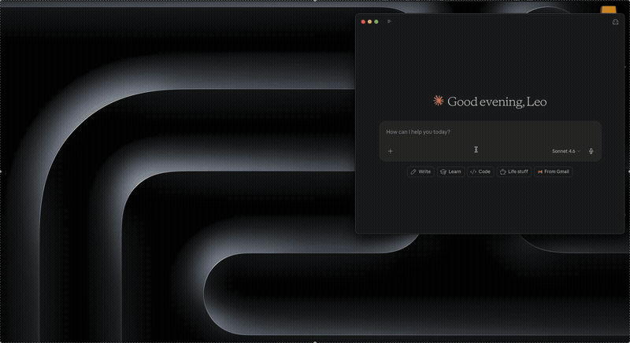

# Malt MCP Server

[](https://pypi.org/project/malt-mcp/)
[](https://python.org)
[](LICENSE)

MCP server for [Malt.fr](https://www.malt.fr). Lets Claude (or any MCP client) read your freelance profile, stats, and missions.

[](#-claude-desktop-mcp-bundle)
[](#-uvx-setup-universal)
[](#docker-coming-soon)

<p align="center">
  
</p>

## Tools

| Tool | Description | Status |
|------|-------------|--------|
| `get_profile` | Get freelance profile info (bio, daily rate, skills, rating) | working |
| `get_statistics` | View profile stats (views, response rate, missions) | working |
| `get_missions` | List mission conversations from messaging | working |
| `get_mission_details` | Get full details of a specific mission (budget, skills, messages) | working |

## 📦 Claude Desktop MCP Bundle

**Prerequisites:** [Claude Desktop](https://claude.ai/download).

**One-click installation:**

1. Download the latest `.mcpb` from [releases](https://github.com/LeoMbm/malt-mcp/releases/latest)
2. Double-click the `.mcpb` file to install it into Claude Desktop
3. Call any Malt tool

First time, a browser window pops up so you can log into Malt. Session is saved in `~/.malt-mcp/` and reused across restarts.

> [!NOTE]
> Google OAuth doesn't work (blocked by Google when automated). Use email/password.

## 🚀 uvx Setup (Universal)

**Prerequisites:** [uv](https://docs.astral.sh/uv/getting-started/installation/) installed.

Add to your MCP client config (Claude Desktop, Claude Code, or any MCP-compatible client):

```json
{
  "mcpServers": {
    "malt": {
      "command": "uvx",
      "args": ["malt-mcp@latest"],
      "env": { "UV_HTTP_TIMEOUT": "300" }
    }
  }
}
```

`@latest` pulls the newest version from PyPI on each launch. First auth-requiring call opens a browser for login.

To log in ahead of time:

```bash
uvx malt-mcp@latest --login
```

### Docker (coming soon)

## ⚙️ CLI Options

| Option | Description |
|--------|-------------|
| `--login` | Open browser to log in and save session |
| `--logout` | Clear stored browser profile |
| `--no-headless` | Show browser window (debug) |
| `--log-level` | Set log level (DEBUG, INFO, WARNING, ERROR) |
| `--timeout` | Browser timeout in ms (default: 5000) |

## ❗ Troubleshooting

**Login issues:**

- Google OAuth won't work. Use email/password.
- Session expired? Re-run `uvx malt-mcp@latest --login`.
- Cloudflare challenge on first load is normal - the browser handles it, give it a few seconds.

**Timeout issues:**

- Pages not loading? Try `--timeout 10000`. Slow connections might need `15000`.

**Browser issues:**

- Headless mode doesn't work - Cloudflare blocks it. The browser window is expected.
- First run downloads Chromium (~200 MB via Patchright). One-time thing.

## 🔒 How it works

Under the hood, this is browser automation via [Patchright](https://github.com/Kaliiiiiiiiii-Vinyzu/patchright) (Playwright fork). No API, no reverse-engineering - it drives a real browser like you would.

- **Credentials stay local.** Cookies live in `~/.malt-mcp/profile/`, nowhere else.
- **Read-only.** Nothing is modified on your Malt account (for now).
- **Runs locally.** The server talks to Malt.fr and nothing else.

> [!IMPORTANT]
> Malt's TOS may prohibit automated tools. Don't bulk-scrape. Use responsibly.

## 🐍 Development

Contributions welcome! See [CONTRIBUTING.md](CONTRIBUTING.md) for architecture guidelines.

```bash
git clone https://github.com/LeoMbm/malt-mcp.git
cd malt-mcp
uv sync --group dev
pre-commit install
```

**Run the MCP Inspector** (local testing):

```bash
uv run mcp dev malt_mcp_server/server.py
```

**Run tests:**

```bash
uv run pytest --cov -v
```

**Type check:**

```bash
uv run ty check
```

## License

[Apache 2.0](LICENSE)
